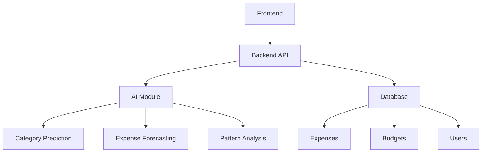

# AI-Powered Expense Tracker

## App Description
The AI-Powered Expense Tracker is a web application that helps users manage their finances through intelligent expense tracking and analysis. The application uses machine learning and time series analysis to provide insights into spending patterns, predict future expenses, and offer personalized recommendations.

### Key Features
- Expense tracking and categorization
- AI-powered category prediction
- Spending pattern analysis
- Future expense forecasting
- Budget management
- Interactive visualizations
- Natural language query processing

## Setup Instructions

### Prerequisites
- Python 3.8+
- Node.js 14+
- npm or yarn
- MongoDB

### Backend Setup
1. Create a virtual environment:
```bash
python -m venv venv
source venv/bin/activate  # On Windows: venv\Scripts\activate
```

2. Install dependencies:
```bash
cd backend
pip install -r requirements.txt
```

3. Set up environment variables:
```bash
cp .env.example .env
# Edit .env with your configuration
```

4. Run the backend server:
```bash
python app.py
```

### Frontend Setup
1. Install dependencies:
```bash
cd frontend
npm install
```

2. Start the development server:
```bash
npm start
```

## Screenshots

### Expense Tracking

*Track and categorize your expenses with AI assistance*

### Budget Management

*Set and monitor your budget limits*

### AI Analytics

*Get insights into your spending patterns*

## Libraries Used

### Backend
- Flask: Web framework
- scikit-learn: Machine learning
- statsmodels: Time series analysis
- pandas: Data manipulation
- pymongo: MongoDB integration
- python-dotenv: Environment management

### Frontend
- React: UI framework
- Material-UI: Component library
- Recharts: Data visualization
- Axios: HTTP client
- React Router: Navigation

## Architecture



### Components
1. **Frontend**
   - React-based user interface
   - Material-UI components
   - Interactive visualizations
   - Real-time updates

2. **Backend API**
   - RESTful endpoints
   - Authentication
   - Data validation
   - Error handling

3. **AI Module**
   - Machine learning for category prediction
   - Time series analysis for forecasting
   - Pattern recognition
   - Natural language processing

4. **Database**
   - MongoDB for data storage
   - Collections for expenses, budgets, and users
   - Indexed queries
   - Data validation

## Future Updates

1. **Enhanced AI Features**
   - Deep learning for better predictions
   - Personalized spending recommendations
   - Advanced pattern recognition
   - Natural language understanding

2. **Additional Features**
   - Multi-currency support
   - Receipt scanning
   - Budget templates
   - Export/import functionality
   - Mobile app

3. **Performance Improvements**
   - Caching mechanisms
   - Optimized queries
   - Real-time updates
   - Offline support

4. **User Experience**
   - Dark mode
   - Customizable dashboards
   - Advanced filtering
   - Keyboard shortcuts

## Testing
The project includes comprehensive test coverage:
- Unit tests for AI module
- API endpoint tests
- Frontend component tests
- Integration tests
- Performance tests

Run tests with:
```bash
# Backend tests
cd backend
python -m pytest

# Frontend tests
cd frontend
npm test
```

## Contributing
1. Fork the repository
2. Create a feature branch
3. Commit your changes
4. Push to the branch
5. Create a Pull Request

## License
This project is licensed under the MIT License - see the LICENSE file for details. 